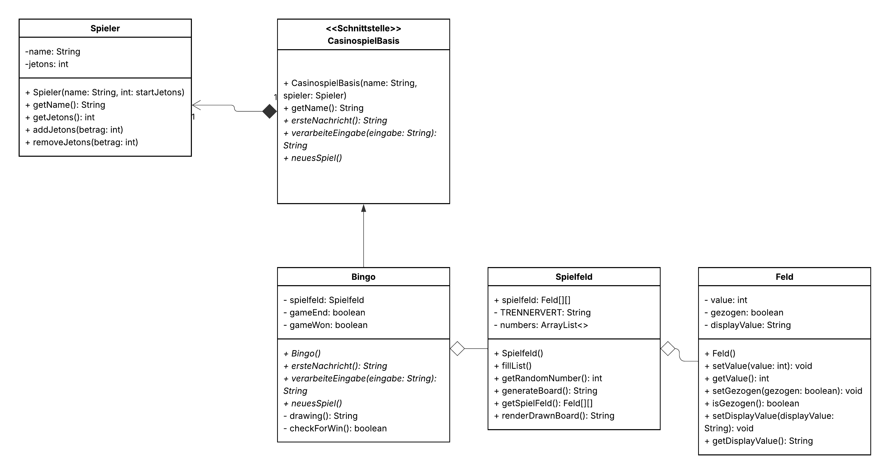
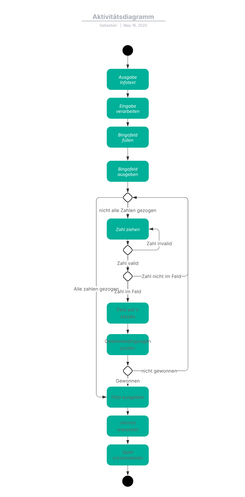

# Bingo 

## Beschreibung
Man setzt Jetons, bekommt ein 3x3-Feld mit Zahlen, und danach werden Zahlen gezogen. Wenn man eine ganze Reihe, Spalte oder Diagonale voll hat, gewinnt man das Doppelte seines Einsatzes. Wenn nicht, sind die Jetons verloren.

## Spielablauf

1. Das Spiel startet mit einer Nachricht.
2. Der Spieler gibt einen Einsatz ein.
3. Es wird ein Spielfeld mit zufälligen Zahlen erstellt.
4. Bis zu 60 Zahlen werden gezogen.
5. Das Feld wird nach jeder gezogenen Zahl überprüft.
6. Wenn eine Linie voll ist → **Bingo!**
7. Am Ende sieht man das fertige Feld.

## Aufbau

- `Bingo.java` → Spielablauf und Gewinnprüfung
- `Spielfeld.java` → Spielfeld erstellen und anzeigen
- `Feld.java` → Einzelnes Feld mit Zahl
- `Spieler.java` → Name, Jetons, Jetons abziehen/hinzufügen
- `CasinospielBasis.java` → Oberklasse für Casinospiele

## Diagramme

